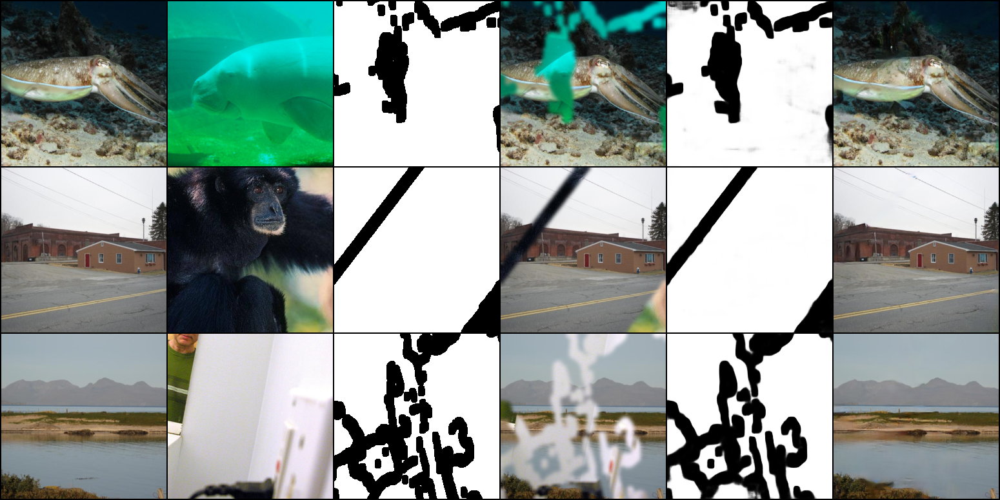

# VCNet-pytorch

> Wang, Yi, Ying-Cong Chen, Xin Tao, and Jiaya Jia. "Vcnet: A robust approach to blind image inpainting." In *European Conference on Computer Vision*, pp. 752-768. Springer, Cham, 2020.

Unofficial implementation of VCNet.

<br/>

## Installation

Clone this repo:

```shell
git clone https://github.com/xyfJASON/VCNet-pytorch.git
cd Context-Encoder-pytorch
```

Create and activate a conda environment:

```shell
conda create -n vcnet python=3.9
conda activate vcnet
```

Install dependencies:

```shell
pip install -r requirements.txt
```

The code will use pretrained VGG16, which can be downloaded by:

```shell
wget https://download.pytorch.org/models/vgg16-397923af.pth -o ~/.cache/torch/hub/checkpoints/vgg16-397923af.pth
```

<br/>


## Datasets

Following the paper, I use [CelebA-HQ](https://github.com/tkarras/progressive_growing_of_gans), [FFHQ](https://github.com/NVlabs/ffhq-dataset), [ImageNet](https://image-net.org/challenges/LSVRC/2012/2012-downloads.php) and [Places](http://places2.csail.mit.edu/index.html) datasets for inpainting. All the images are resized or cropped to 256x256. When training on FFHQ, CelebA-HQ and ImageNet are the noise source. When training on ImageNet and Places, they are the noise source for each other.

I've trained and tested the model on two kinds of masks:

1. Generated brushstroke-like masks + iterative gaussian smoothing proposed by [GMCNN](https://arxiv.org/abs/1810.08771). This is the closest setup to the VCNet paper, though the brushstroke generation algorithm and parameters may still be different.
2. [Irregular Mask Dataset](https://nv-adlr.github.io/publication/partialconv-inpainting) provided by NVIDIA + direct gaussian smoothing. The masks are evenly splitted by area ratio and thus enable us to test the model's performance w.r.t masks' size.

Please see [notes on masks](./docs/notes-on-masks.md) for more information.

<br/>


## Training

The training procedure is composed of two stages. First, MPN and RIN are separately trained; then, after both networks are converged, they're jointly optimized.

```shell
# First stage (separately train MPN and RIN)
accelerate-launch train_separate.py [-c CONFIG] [-e EXP_DIR] [--xxx.yyy zzz ...]
# Second stage (jointly train MPN and RIN)
accelerate-launch train_joint.py [-c CONFIG] [-e EXP_DIR] --train.pretrained PRETRAINED [--xxx.yyy zzz ...]
```

- This repo uses the [🤗 Accelerate](https://huggingface.co/docs/accelerate/index) library for multi-GPUs/fp16 supports. Please read the [documentation](https://huggingface.co/docs/accelerate/basic_tutorials/launch#using-accelerate-launch) on how to launch the scripts on different platforms.
- Results (logs, checkpoints, tensorboard, etc.) of each run will be saved to `EXP_DIR`. If `EXP_DIR` is not specified, they will be saved to `runs/exp-{current time}/`.
- To modify some configuration items without creating a new configuration file, you can pass `--key value` pairs to the script. For example, as shown above, when training on the second stage, you can load the pretrained model in the first stage by `--train.pretrained /path/to/pretrained/model.pt`.

For example, to train the model on FFHQ:

```shell
# First stage
accelerate-launch train_separate.py -c ./configs/separate_ffhq_brush_realnoise.yaml
# Second stage
accelerate-launch train_joint.py -c ./configs/joint_ffhq_brush_realnoise.yaml --train.pretrained ./runs/exp-xxxx/ckpt/step079999/model.pt
```

<br/>


## Evaluation

```shell
accelerate-launch evaluate.py -c CONFIG \
                              --model_path MODEL_PATH \
                              [--n_eval N_EVAL] \
                              [--micro_batch MICRO_BATCH]
```

- This repo uses the [🤗 Accelerate](https://huggingface.co/docs/accelerate/index) library for multi-GPUs/fp16 supports. Please read the [documentation](https://huggingface.co/docs/accelerate/basic_tutorials/launch#using-accelerate-launch) on how to launch the scripts on different platforms.
- You can adjust the batch size on each device by `--micro_batch MICRO_BATCH`. The evaluation speed depends on your system and larger batch size doesn't necessarily result in faster evaluation.
- The metrics include BCE, PSNR, SSIM and LPIPS.

<br/>


## Sampling

```shell
accelerate-launch sample.py -c CONFIG \
                            --model_path MODEL_PATH \
                            --n_samples N_SAMPLES \
                            --save_dir SAVE_DIR \
                            [--micro_batch MICRO_BATCH]
```

- This repo uses the [🤗 Accelerate](https://huggingface.co/docs/accelerate/index) library for multi-GPUs/fp16 supports. Please read the [documentation](https://huggingface.co/docs/accelerate/basic_tutorials/launch#using-accelerate-launch) on how to launch the scripts on different platforms.
- You can adjust the batch size on each device by `--micro_batch MICRO_BATCH`. The sampling speed depends on your system and larger batch size doesn't necessarily result in faster sampling.

<br/>


## Downstream tasks

The pretrained model can be adapted to downstream image restoration tasks as long as the corrputed images, ground-truth images and ground-truth masks are provided in the training set. Specifically, this code supports finetuning and testing on [LOGO dataset](https://github.com/vinthony/deep-blind-watermark-removal#datasets) (watermark removal) and [ISTD dataset](https://github.com/DeepInsight-PCALab/ST-CGAN#istd-dataset) (shadow removal).

<br/>


## Results

:warning: The BCE and SSIM in the paper look strange to me. The SSIM seems to be too low and I doubt if the authors scaled the image to [0,255] for evaluation rather than [0,1]. The BCE is much larger than mine and I haven't figured out why. Please let me know if anyone has any ideas on this problem.

**All metrics are evaluated on 10K images**.


### FFHQ (CelebA-HQ & ImageNet as the noise sources)

**Quantitative results**:

<table align="center">
  <tr>
    <th align="center">Mask type and ratio</th>
    <th align="center">BCE</th>
    <th align="center">PSNR</th>
    <th align="center">SSIM</th>
    <th align="center">LPIPS</th>
  </tr>
  <tr>
    <td align="center">irregular (0.01, 0.1]</td>
    <td align="center">0.1172</td>
    <td align="center">31.4808</td>
    <td align="center">0.9488</td>
    <td align="center">0.0286</td>
  </tr>
  <tr>
    <td align="center">irregular (0.1, 0.2]</td>
    <td align="center">0.1436</td>
    <td align="center">27.8591</td>
    <td align="center">0.9119</td>
    <td align="center">0.0545</td>
  </tr>
  <tr>
    <td align="center">irregular (0.2, 0.3]</td>
    <td align="center">0.1385</td>
    <td align="center">25.3436</td>
    <td align="center">0.8671</td>
    <td align="center">0.0856</td>
  </tr>
  <tr>
    <td align="center">irregular (0.3, 0.4]</td>
    <td align="center">0.1282</td>
    <td align="center">23.2898</td>
    <td align="center">0.8189</td>
    <td align="center">0.1199</td>
  </tr>
  <tr>
    <td align="center">irregular (0.4, 0.5]</td>
    <td align="center">0.1276</td>
    <td align="center">21.6085</td>
    <td align="center">0.7659</td>
    <td align="center">0.1589</td>
  </tr>
  <tr>
    <td align="center">irregular (0.5, 0.6]</td>
    <td align="center">0.1270</td>
    <td align="center">18.9777</td>
    <td align="center">0.6808</td>
    <td align="center">0.2279</td>
  </tr>
  <tr>
    <td align="center">brushstoke</td>
    <td align="center">0.0793</td>
    <td align="center">23.6723</td>
    <td align="center">0.8139</td>
    <td align="center">0.1302</td>
  </tr>
</table>


**Selected samples**:

<p align="center">
   
</p>


### Places (ImageNet as the noise source)

**Quantitative results**:

<table align="center">
  <tr>
    <th align="center">Mask type and ratio</th>
    <th align="center">BCE</th>
    <th align="center">PSNR</th>
    <th align="center">SSIM</th>
    <th align="center">LPIPS</th>
  </tr>
  <tr>
    <td align="center">irregular (0.01, 0.1]</td>
    <td align="center">0.0759</td>
    <td align="center">31.7148</td>
    <td align="center">0.9615</td>
    <td align="center">0.0291</td>
  </tr>
  <tr>
    <td align="center">irregular (0.1, 0.2]</td>
    <td align="center">0.1000</td>
    <td align="center">27.2678</td>
    <td align="center">0.9181</td>
    <td align="center">0.0658</td>
  </tr>
  <tr>
    <td align="center">irregular (0.2, 0.3]</td>
    <td align="center">0.0984</td>
    <td align="center">24.3350</td>
    <td align="center">0.8626</td>
    <td align="center">0.1119</td>
  </tr>
  <tr>
    <td align="center">irregular (0.3, 0.4]</td>
    <td align="center">0.0875</td>
    <td align="center">22.2100</td>
    <td align="center">0.8028</td>
    <td align="center">0.1602</td>
  </tr>
  <tr>
    <td align="center">irregular (0.4, 0.5]</td>
    <td align="center">0.0828</td>
    <td align="center">20.5598</td>
    <td align="center">0.7396</td>
    <td align="center">0.2104</td>
  </tr>
  <tr>
    <td align="center">irregular (0.5, 0.6]</td>
    <td align="center">0.0655</td>
    <td align="center">18.0231</td>
    <td align="center">0.6402</td>
    <td align="center">0.2918</td>
  </tr>
  <tr>
    <td align="center">brushstroke</td>
    <td align="center">0.0550</td>
    <td align="center">22.6913</td>
    <td align="center">0.7880</td>
    <td align="center">0.1687</td>
  </tr>
</table>


**Selected samples**:

<p align="center">
   
</p>


### ImageNet (Places as the noise source)

**Quantitative results**:

<table align="center">
  <tr>
    <th align="center">Mask type and ratio</th>
    <th align="center">BCE</th>
    <th align="center">PSNR</th>
    <th align="center">SSIM</th>
    <th align="center">LPIPS</th>
  </tr>
  <tr>
    <td align="center">irregular (0.01, 0.1]</td>
    <td align="center">0.0813</td>
    <td align="center">31.1359</td>
    <td align="center">0.9497</td>
    <td align="center">0.0306</td>
  </tr>
  <tr>
    <td align="center">irregular (0.1, 0.2]</td>
    <td align="center">0.1021</td>
    <td align="center">27.1368</td>
    <td align="center">0.9063</td>
    <td align="center">0.0673</td>
  </tr>
  <tr>
    <td align="center">irregular (0.2, 0.3]</td>
    <td align="center">0.0982</td>
    <td align="center">24.3580</td>
    <td align="center">0.8510</td>
    <td align="center">0.1145</td>
  </tr>
  <tr>
    <td align="center">irregular (0.3, 0.4]</td>
    <td align="center">0.0853</td>
    <td align="center">22.3020</td>
    <td align="center">0.7922</td>
    <td align="center">0.1644</td>
  </tr>
  <tr>
    <td align="center">irregular (0.4, 0.5]</td>
    <td align="center">0.0789</td>
    <td align="center">20.6609</td>
    <td align="center">0.7292</td>
    <td align="center">0.2182</td>
  </tr>
  <tr>
    <td align="center">irregular (0.5, 0.6]</td>
    <td align="center">0.0579</td>
    <td align="center">18.1530</td>
    <td align="center">0.6329</td>
    <td align="center">0.3091</td>
  </tr>
  <tr>
    <td align="center">brushstroke</td>
    <td align="center">0.0528</td>
    <td align="center">22.8164</td>
    <td align="center">0.7815</td>
    <td align="center">0.1717</td>
  </tr>
</table>


**Selected samples**:

<p align="center">
   
</p>


### Watermark removal

<p align="center">
   
</p>


### Shadow removal

<p align="center">
   
</p>
